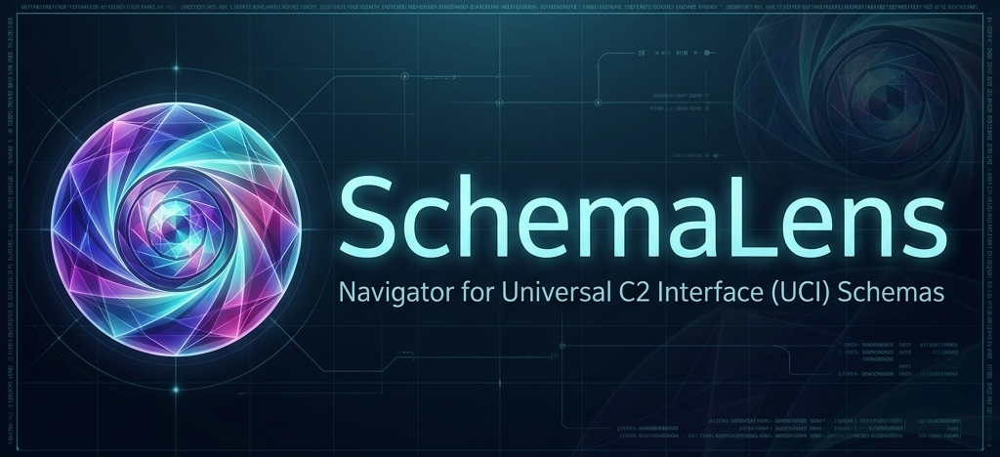

  

**SchemaLens** is a high-performance, web-based navigator for any XSD schema. It is engineered to solve the extreme complexity of large schema files such as the [Universal Command and Control Interface (UCI)](https://github.com/modular-af/UCI). It transforms dense XML definitions into interactive, searchable, and highly readable documentation.

---

### ✨ Core Features

*   **⚡ Instant Navigation**: Virtualized tree-view for 10,000+ elements with zero lag.
*   **🔍 Semantic Search**: Instant spotlight search (`Ctrl+K`) for types, messages, and elements.
*   **📦 Workspace Management**: Drag-and-drop XSD files into a local, isolated sandbox.
*   **🎯 Type Teleportation**: Jump between definitions and references instantly.
*   **🛠️ XML Playground**: Automatic generation of valid sample XML messages.
*   **🛡️ Health Dashboard**: Built-in integrity checks for missing references and namespace collisions.
*   **⌨️ Power User Ready**: Press `?` anytime for a full list of keyboard shortcuts.


---

### 🚀 Quick Start

```bash
# 1. Clone & Enter
git clone https://github.com/michaeltanner/schema-lens.git && cd schema-lens

# 2. Install & Launch
npm install && npm run dev
```

### 🌐 Deployment & Optimization

#### Network Access
To view on a tablet or phone over your local network, bind the server to all interfaces:
```bash
npm run dev -- -H 0.0.0.0
```

> [!IMPORTANT]
> To enable Hot Module Replacement (HMR) over your network, create a `.env.local` file and add your local IP:
> `ALLOWED_DEV_ORIGINS=localhost,192.168.1.XX`

#### Performance Tuning
For massive schemas (>20MB), we recommend running the optimized production bundle to ensure maximum UI responsiveness:
```bash
npm run build && npm run start
```

---

### 🏗️ Architecture

| Layer       | Technologies                              |
| :---------- | :---------------------------------------- |
| **Engine**  | Next.js 15, TypeScript (Strict), Node.js  |
| **Parsing** | `fast-xml-parser`, `FlexSearch`           |
| **State**   | `Zustand` (Granular Reactive Stores)      |
| **UI/UX**   | Vanilla CSS, React Flow, `react-virtuoso` |

---

### 🛰️ Standards & Compatibility

**SchemaLens** is designed to be a generic, robust navigator for any valid XML Schema Definition (XSD). While it is verified against the official UCI releases, it handles any large-scale schema with deep nesting and cross-references.

*   **XSD Support**: Full support for `xs:element`, `xs:complexType`, `xs:group`, and more.
*   **UCI Optimization**: Specifically tuned for the massive structures defined by the [UCI Standard](https://github.com/modular-af/UCI).

---

### 🤝 Contributing

We're building SchemaLens to bridge the gap between technical complexity and human clarity. Whether you're a UCI expert, a TypeScript wizard, or just found a typo, we'd love your help!

*   **Found a Bug?** Open an [issue](https://github.com/michaeltanner/schema-lens/issues) with a reproduction schema.
*   **Have an Idea?** Start a discussion or submit a feature request.
*   **Want to Code?** Check out our [CONTRIBUTING.md](CONTRIBUTING.md) to get started with our development workflow.

Join us in making complex schemas approachable for everyone.
---

### 🛠️ Development

#### Versioning & Releases
We use [bumpp](https://github.com/antfu/bumpp) to manage project versioning. The version is controlled in `package.json` and automatically reflected in the UI.

To trigger a new version:
```bash
npm run release
```
This will allow you to interactively choose the next version (patch, minor, or major) and automatically update all relevant files.

### ⚖️ Disclaimer

This project is a personal effort by Michael Tanner and is not affiliated with, endorsed by, or connected to any specific organization or standards body.

---

Licensed under **MIT** • Built for the **Schema Community**
